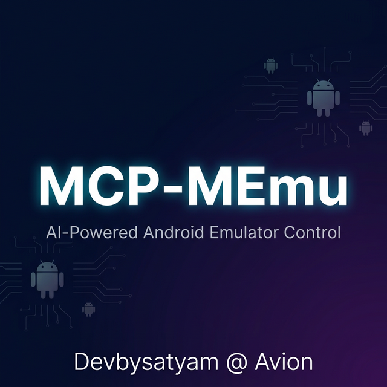

<p align="center">
  
</p>

<h1 align="center">MCP-MEmu</h1>
<h3 align="center">AI-Powered Android Emulator Control via Model Context Protocol</h3>
<p align="center"><em>by Devbysatyam @ Avion</em></p>

<p align="center">
  <a href="https://github.com/devbysatyam/mcp-memu/stargazers"></a>
  <a href="https://github.com/devbysatyam/mcp-memu/network/members"></a>
  <a href="https://github.com/devbysatyam/mcp-memu/issues"></a>
  <a href="LICENSE"></a>
  <a href="https://www.python.org/"></a>
  <a href="https://modelcontextprotocol.io/"></a>
</p>

<p align="center">
  <a href="#-features">Features</a> •
  <a href="#-quick-start">Quick Start</a> •
  <a href="#-use-cases">Use Cases</a> •
  <a href="#-tool-reference">Tools</a> •
  <a href="#-prompts">Prompts</a> •
  <a href="#-security">Security</a> •
  <a href="#-architecture">Architecture</a>
</p>

---

## 🌟 What is MCP-MEmu?

**MCP-MEmu** is a Model Context Protocol (MCP) server that gives AI agents complete control over [MEmu Android Emulator](https://www.memuplay.com/). It wraps the MEMUC CLI through [PyMEMUC](https://github.com/pyclashbot/pymemuc) and exposes **69 tools**, **8 resources**, and **7 prompt templates** for seamless AI-driven Android automation.

Connect it to **Claude Desktop**, **Antigravity**, **Cursor**, or any MCP-compatible client — and your AI can boot VMs, install apps, automate UI, take screenshots, spoof GPS, transfer files, and much more.

---

## ✨ Features

### 🎮 69 Automation Tools

| Category | Count | Highlights |
|---|:---:|---|
| **🔄 Lifecycle** | 15 | Create, clone, start, stop, reboot, delete, export/import VMs |
| **⚙️ Configuration** | 8 | CPU, RAM, resolution, GPS, IMEI, device fingerprint randomization |
| **📱 App Management** | 7 | Install APK, launch, stop, uninstall, clear data, list packages |
| **👆 UI Interaction** | 14 | Tap, swipe, long press, text input, keys, scroll, rotate, zoom, shake |
| **📸 Screenshot** | 3 | Save to file, base64 for AI vision, get screen dimensions |
| **🌐 Network & Sensors** | 6 | Connect/disconnect, GPS spoofing, accelerometer, public IP |
| **💻 Shell & Advanced** | 8 | Shell commands, ADB passthrough, file push/pull, clipboard |
| **🚀 Compound** | 8 | Boot & ready, fresh start app, batch install, monkey test, snapshots |

### 📚 8 MCP Resources (LLM Context)

| Resource | Description |
|---|---|
| `memu://guide` | Comprehensive getting started guide with anti-hallucination rules |
| `memu://tools` | Complete tool reference with all args and descriptions |
| `memu://workflows` | Step-by-step automation recipes |
| `memu://config-keys` | All VM configuration keys with valid values |
| `memu://vms` | Live VM list with status (dynamic) |
| `memu://vm/{index}/status` | Individual VM status (dynamic) |
| `memu://security` | Security model documentation |

### 💡 7 Prompt Templates (Guided Workflows)

| Prompt | Description |
|---|---|
| `automate_app_testing` | Full app testing workflow with screenshot-first rules |
| `setup_new_vm` | Create → configure → boot from scratch |
| `ui_automation_guide` | Screen coordinate system, swipe directions, input reference |
| `batch_device_farm` | Set up multiple VMs with diverse configs |
| `debug_vm_issues` | Diagnostic flowchart with error → fix mapping |
| `gps_spoofing_guide` | 10 city presets with verification steps |
| `file_transfer_guide` | Push/pull files with VM path reference |

### 🛡️ Security

- **Protected VM Registry** — Pre-existing VMs cannot be deleted/stopped/renamed
- **Input Validation** — VM index validation, dangerous command blocklist
- **Audit Logging** — All destructive operations logged with timestamps
- **Command Blocklist** — Blocks `rm -rf /`, `mkfs`, `dd`, `reboot`, `shutdown`, `format`, `wipe`

---

## 🚀 Quick Start

### Prerequisites

| Requirement | Details |
|---|---|
| **OS** | Windows 10/11 |
| **MEmu Player** | [Download](https://www.memuplay.com/) (installed & working) |
| **Python** | 3.10 or higher |
| **uv** | [Install](https://docs.astral.sh/uv/) — Python package manager |
| **Admin Privileges** | Required by MEMUC CLI |

### Installation

```bash
# Clone the repository
git clone https://github.com/devbysatyam/mcp-memu.git
cd mcp-memu

# Install dependencies
uv sync
```

### Run the Server

```bash
# Start the MCP server (stdio transport)
python server.py

# Or test with MCP Inspector (opens browser UI)
mcp dev server.py
```

### Connect to Claude Desktop

Add to `%APPDATA%\Claude\claude_desktop_config.json`:

```json
{
  "mcpServers": {
    "memu": {
      "command": "uv",
      "args": ["run", "--directory", "C:\\path\\to\\mcp-memu", "python", "server.py"]
    }
  }
}
```

### Connect to Antigravity / Gemini

Add to your MCP server settings:

```json
{
  "memu": {
    "command": "uv",
    "args": ["run", "--directory", "C:\\path\\to\\mcp-memu", "python", "server.py"]
  }
}
```

---

## 📖 Use Cases

### 1. 📱 Automated App Testing

> "Install my APK, launch it, go through the onboarding flow, and take screenshots at each step."

The AI agent will:
1. Boot the VM and wait for Android to fully load
2. Install your APK via `install_apk`
3. Launch the app and take a screenshot to see the screen
4. Navigate through UI using `tap`, `swipe`, `input_text`
5. Capture screenshots at each step for visual verification

```
Tools used: boot_and_ready → install_apk → launch_app → screenshot_base64 → tap → input_text → take_screenshot
```

### 2. 🌍 GPS-Based Testing

> "Set the location to San Francisco and check if the app shows nearby restaurants."

```
Tools used: set_gps_location(lat=37.7749, lng=-122.4194) → launch_app → screenshot_base64
```

### 3. 🏭 Device Farm Setup

> "Create 3 VMs with different resolutions and device fingerprints for compatibility testing."

The AI agent will:
1. Create 3 new Android 9 VMs
2. Configure each with different CPU, RAM, resolution
3. Randomize device fingerprints so each looks unique
4. Boot all VMs and verify they're working

```
Tools used: create_vm (x3) → set_vm_cpu → set_vm_memory → set_vm_resolution → randomize_vm_device → boot_and_ready
```

### 4. 🔄 CI/CD Integration

> "Run a monkey test on the app and capture the results."

```
Tools used: boot_and_ready → install_apk → run_monkey_test → take_screenshot → pull_file (logs)
```

### 5. 📋 Clipboard & File Transfer

> "Push a config file to the VM, read back the app's output log."

```
Tools used: push_file → launch_app → pull_file → set_clipboard → get_clipboard
```

### 6. 🔧 VM Configuration Management

> "Read current config, change to 4 CPU cores and 4GB RAM, then reboot."

```
Tools used: get_all_vm_config → stop_vm → set_vm_cpu(cores=4) → set_vm_memory(mb=4096) → boot_and_ready
```

---

## 🔧 Tool Reference

### Lifecycle Management

| Tool | Description | Key Args |
|---|---|---|
| `list_vms` | List all VMs with status | — |
| `get_vm_status` | Check running/stopped | `vm_index` |
| `start_vm` | Boot a VM | `vm_index` |
| `stop_vm` | Graceful shutdown | `vm_index` |
| `reboot_vm` | Restart a VM | `vm_index` |
| `create_vm` | Create new VM | `vm_version` (76=Android 7, 96=Android 9) |
| `delete_vm` | Permanently delete | `vm_index` |
| `clone_vm` | Clone existing VM | `vm_index`, `new_name` |
| `rename_vm` | Rename a VM | `vm_index`, `new_name` |
| `export_vm` | Export to .ova | `vm_index`, `output_path` |
| `import_vm` | Import from .ova | `ova_path` |
| `compress_vm` | Compress disk | `vm_index` |
| `sort_out_all_vms` | Re-tile windows | — |
| `stop_all_vms` | Stop all non-protected | — |
| `check_task_status` | Async task status | `task_id` |

### Configuration

| Tool | Description | Key Args |
|---|---|---|
| `get_all_vm_config` | Read all common settings | `vm_index` |
| `get_vm_config` | Read single setting | `vm_index`, `key` |
| `set_vm_config` | Write single setting | `vm_index`, `key`, `value` |
| `set_vm_cpu` | Set CPU cores | `vm_index`, `cores` (1/2/4/8) |
| `set_vm_memory` | Set RAM | `vm_index`, `mb` |
| `set_vm_resolution` | Set display | `vm_index`, `width`, `height`, `dpi` |
| `set_vm_gps` | Set GPS | `vm_index`, `lat`, `lng` |
| `randomize_vm_device` | Random fingerprint | `vm_index` |

### App Management

| Tool | Description | Key Args |
|---|---|---|
| `list_apps` | Installed packages | `vm_index` |
| `install_apk` | Install APK file | `vm_index`, `apk_path` |
| `uninstall_app` | Remove app | `vm_index`, `package` |
| `launch_app` | Start app | `vm_index`, `package` |
| `stop_app` | Force stop | `vm_index`, `package` |
| `clear_app_data` | Wipe app data | `vm_index`, `package` |
| `create_app_shortcut` | Desktop shortcut | `vm_index`, `package` |

### UI Interaction

| Tool | Description | Key Args |
|---|---|---|
| `tap` | Tap coordinates | `vm_index`, `x`, `y` |
| `swipe` | Swipe gesture | `vm_index`, `x1`, `y1`, `x2`, `y2`, `duration_ms` |
| `long_press` | Long press | `vm_index`, `x`, `y`, `duration_ms` |
| `input_text` | Type text | `vm_index`, `text` |
| `send_key` | Send key event | `vm_index`, `key` (home/back/menu/volumeup/volumedown) |
| `press_enter` | Enter key | `vm_index` |
| `press_back` | Back button | `vm_index` |
| `press_home` | Home button | `vm_index` |
| `shake_device` | Shake gesture | `vm_index` |
| `rotate_screen` | Toggle orientation | `vm_index` |
| `zoom_in` / `zoom_out` | Pinch zoom | `vm_index` |
| `scroll_up` / `scroll_down` | Scroll | `vm_index`, `x` |

### Screenshot & Capture

| Tool | Description | Key Args |
|---|---|---|
| `take_screenshot` | Save to file | `vm_index`, `save_path` |
| `screenshot_base64` | Base64 PNG for AI vision | `vm_index` |
| `get_screen_size` | Current resolution | `vm_index` |

### Network & Sensors

| Tool | Description | Key Args |
|---|---|---|
| `connect_network` | Enable internet | `vm_index` |
| `disconnect_network` | Disable internet | `vm_index` |
| `get_public_ip` | Get public IP | `vm_index` |
| `set_gps_location` | Spoof GPS | `vm_index`, `lat`, `lng` |
| `set_accelerometer` | Set sensor | `vm_index`, `x`, `y`, `z` |
| `get_adb_connection_info` | Get ADB address | `vm_index` |

### Shell & Advanced

| Tool | Description | Key Args |
|---|---|---|
| `execute_shell` | Run shell command | `vm_index`, `command` |
| `send_adb` | Raw ADB command | `vm_index`, `command` |
| `get_device_info` | Model/version/CPU | `vm_index` |
| `get_running_apps` | Running processes | `vm_index` |
| `pull_file` | VM → Host | `vm_index`, `remote_path`, `local_path` |
| `push_file` | Host → VM | `vm_index`, `local_path`, `remote_path` |
| `set_clipboard` | Set clipboard | `vm_index`, `text` |
| `get_clipboard` | Read clipboard | `vm_index` |

### Compound (Multi-Step)

| Tool | Description |
|---|---|
| `wait_for_boot` | Poll until Android is fully booted |
| `boot_and_ready` | Start VM + wait for boot |
| `fresh_start_app` | Stop → clear data → relaunch |
| `install_and_launch` | Install APK + launch |
| `clone_and_configure` | Clone + set CPU/RAM/resolution |
| `batch_install` | Install multiple APKs (`;`-separated) |
| `full_vm_snapshot` | Stop → export → restart |
| `run_monkey_test` | Random UI stress test |

---

## 🏗️ Architecture

```
┌─────────────────────────────────────────────────────┐
│                   MCP Client                        │
│   (Claude Desktop / Antigravity / Cursor / etc.)    │
└───────────────────────┬─────────────────────────────┘
                        │ JSON-RPC (stdio)
┌───────────────────────┴─────────────────────────────┐
│                  MCP-MEmu Server                     │
│                   server.py                          │
│                                                      │
│  ┌──────────┐  ┌──────────┐  ┌──────────────────┐   │
│  │  Tools   │  │Resources │  │    Prompts        │   │
│  │  (69)    │  │  (8)     │  │    (7 templates)  │   │
│  └────┬─────┘  └──────────┘  └──────────────────┘   │
│       │                                              │
│  ┌────┴──────────────────────────────────────────┐   │
│  │          Security Layer                        │   │
│  │  • Protected VM registry                      │   │
│  │  • Input validation & command blocklist        │   │
│  │  • Audit logging                              │   │
│  └────┬──────────────────────────────────────────┘   │
│       │                                              │
│  ┌────┴──────────────────────────────────────────┐   │
│  │     PyMEMUC + ADB Helpers                     │   │
│  │  • MEMUC CLI wrapper                          │   │
│  │  • ADB pull/push with auto-reconnect          │   │
│  └────┬──────────────────────────────────────────┘   │
└───────┴──────────────────────────────────────────────┘
        │
┌───────┴──────────────────────────────────────────────┐
│              MEmu Android Emulator                    │
│         (MEMUC CLI + ADB over TCP)                   │
└──────────────────────────────────────────────────────┘
```

## 📁 Project Structure

```
mcp-memu/
├── assets/
│   └── banner.png             # GitHub banner image
├── tools/
│   ├── lifecycle.py           # VM start, stop, create, delete, clone
│   ├── config.py              # CPU, RAM, resolution, GPS settings
│   ├── apps.py                # Install, launch, stop apps
│   ├── input.py               # Tap, swipe, type, scroll, shake
│   ├── capture.py             # Screenshots (file & base64)
│   ├── network.py             # Network, GPS, accelerometer
│   ├── shell.py               # Shell, ADB, file transfer, clipboard
│   └── compound.py            # High-level combined operations
├── resources/
│   ├── vm_status.py           # MCP resources (guides, tools ref, config keys)
│   └── prompts.py             # MCP prompt templates (7 workflows)
├── utils/
│   ├── memuc_instance.py      # Singleton PyMemuc + security layer
│   └── adb_helpers.py         # ADB pull/push with timeout & reconnect
├── server.py                  # FastMCP entry point
├── pyproject.toml             # Project metadata & dependencies
├── protected_vms.json         # Auto-generated (gitignored)
├── SECURITY.md                # Security documentation
├── LICENSE                    # MIT License
└── README.md                 # This file
```

---

## 📦 Dependencies

| Package | Version | Purpose |
|---|---|---|
| [pymemuc](https://github.com/pyclashbot/pymemuc) | ≥ 0.6.0 | Python wrapper for MEmu's MEMUC CLI |
| [mcp[cli]](https://modelcontextprotocol.io/) | ≥ 1.0.0 | Model Context Protocol SDK + CLI tools |
| [Pillow](https://python-pillow.org/) | ≥ 12.1.1 | Image processing for screenshots |

All dependencies are managed via `pyproject.toml` and installed automatically with `uv sync`.

---

## 🔒 Security

See [SECURITY.md](SECURITY.md) for full details.

| Feature | Description |
|---|---|
| **Protected VMs** | Pre-existing VMs snapshotted on startup — cannot be deleted/stopped |
| **Input Validation** | VM index validated, negative values rejected |
| **Command Blocklist** | `rm -rf /`, `mkfs`, `dd`, `reboot`, `shutdown`, `format`, `wipe` blocked |
| **Audit Logging** | All destructive ops logged with timestamps to stderr |
| **Local-Only Transport** | Uses stdio — no network exposure by default |

For remote deployments, implement **OAuth 2.1 with PKCE** per the [MCP specification](https://modelcontextprotocol.io/specification/2025-03-26/basic/authorization).

---

## ⚠️ Known Limitations

| Limitation | Details | Workaround |
|---|---|---|
| **Clone requires disk space** | Each clone needs 2-4GB | Free disk space before cloning |
| **DirectX blank screenshots** | MEmu's DirectX mode produces blank images | Set `graphics_render_mode=0` (OpenGL) |
| **ADB requires WiFi** | ADB over TCP needs VM WiFi enabled | Call `connect_network()` first |
| **Config needs stopped VM** | CPU/RAM/resolution only changeable when stopped | `stop_vm()` before config changes |
| **Windows only** | MEmu is Windows-only software | No Linux/macOS support |

---

## 🤝 Contributing

1. Fork the repository
2. Create your feature branch (`git checkout -b feature/amazing`)
3. Commit your changes (`git commit -m 'Add amazing feature'`)
4. Push to the branch (`git push origin feature/amazing`)
5. Open a Pull Request

---

## 📝 License

This project is licensed under the MIT License — see the [LICENSE](LICENSE) file for details.

---

## 🙏 Acknowledgments

- [MEmu Player](https://www.memuplay.com/) — Android emulator
- [PyMEMUC](https://github.com/pyclashbot/pymemuc) — Python MEMUC wrapper
- [Model Context Protocol](https://modelcontextprotocol.io/) — AI tool interoperability standard
- [FastMCP](https://github.com/jlowin/fastmcp) — Python MCP SDK

---

<p align="center">
  <strong>Built with ❤️ by <a href="https://github.com/devbysatyam">Devbysatyam</a> @ Avion</strong>
</p>
